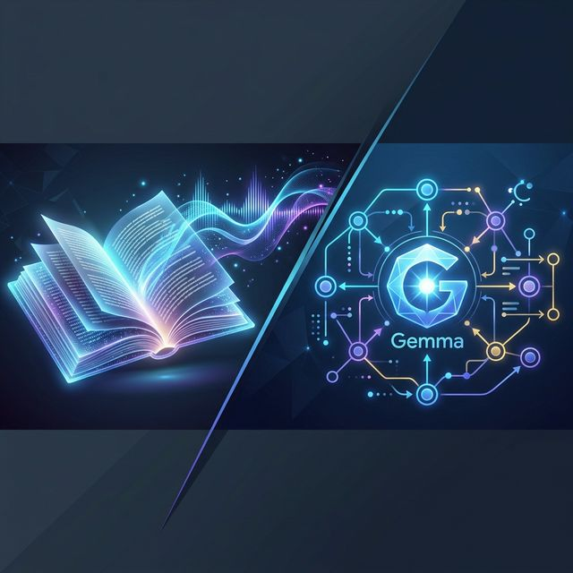

# 📚 AI Reading & Learning Hub



<div align="center">

[](https://opensource.org/licenses/MIT)
[](https://www.python.org/downloads/)
[](https://nodejs.org/en/)
[](https://developer.nvidia.com/cuda-downloads)
[](https://github.com/letuhao/tts-novel-reader)

An end-to-end open-source toolkit for interactive reading and AI-assisted English learning.

[Quick Start](#🚀-quick-start) • [Projects](#📁-projects-inside) • [Prerequisites](#1-system-prerequisites) • [Roadmap](#🛣️-roadmap)

</div>

---

## 📁 Projects Inside

This monorepo is home to two main initiatives, both leveraging state-of-the-art AI to transform how we consume content and learn languages.

### 1. 🎧 Novel AI Reader (`novel-app`)
**Status:** 🟠 Beta (Usable, active development)

Turn raw novel text into an immersive audio experience. This tool chunks long novels into manageable paragraphs and uses specialized AI to detect roles (Narrator vs. Character) and generate synchronized TTS audio.

*   **Core Tech:** Node.js, React, [VietTTS](https://huggingface.co/dangvansam/viet-tts), [Qwen3-8B](https://ollama.com/) (Role detection).
*   **Key Features:**
    *   Automatic novel chunking and paragraph management.
    *   AI Role Detection for distinct character voices.
    *   High-fidelity Vietnamese TTS with 24+ preset voices.
    *   Persistent storage and web-based playback.

### 2. 🎓 English Tutor Agent (`english-tutor`)
**Status:** 🟡 Early Alpha (Architecture ready, core features online)

A LangGraph-based AI tutor designed to provide a structured yet conversational environment for learning English.

*   **Core Tech:** [LangGraph](https://www.langchain.com/langgraph), [Gemma](https://ai.google.dev/gemma) (Fine-tuned for teaching), FastAPI, React.
*   **Key Features:**
    *   Multi-agent design for specialized tutoring paths.
    *   Voice-first interaction with integrated TTS and STT.
    *   Stateful conversations that remember your learning progress.
    *   *Upcoming:* Pronunciation scoring and personalized learning curves.

---

## 🛠️ Monorepo Architecture

```bash
.
├── 📖 novel-app/             # AI-powered Novel Reader
│   ├── backend/             # Express server + SQLite database
│   └── frontend/            # React + Vite interface
├── 🎓 english-tutor-agent/   # LangGraph backend for English Tutor
├── 📱 english-tutor-app/     # Frontend interface for English Tutor
├── 🎙️ tts/                  # TTS backend services (VietTTS)
├── 📝 models/               # Shared AI model weights/assets
└── 🛠️ scripts-utils/        # Common management scripts (.ps1, .py)
```

---

## 🚀 Quick Start

### 1. System Prerequisites (Must-Haves)

To run these heavy AI models locally, you'll need a solid setup:
- **GPU:** NVIDIA GPU with 8GB+ VRAM (highly recommended).
- **Driver:** Latest [NVIDIA Drivers](https://www.nvidia.com/Download/index.aspx).
- **Core:** [CUDA Toolkit 12.4](https://developer.nvidia.com/cuda-downloads) & [cuDNN 9.x](https://developer.nvidia.com/cudnn).
- **Runtimes:** [Python 3.10+](https://www.python.org/downloads/) & [Node.js 18 LTS+](https://nodejs.org/) & [Ollama](https://ollama.com/).

### 2. Common Infrastructure
Both projects rely on a few common services:

```powershell
# 1. Install Ollama & Pull Models
ollama serve
ollama pull qwen3:8b        # For Novel role detection
ollama pull gemma2:9b       # For English Tutor logic

# 2. Setup TTS (VietTTS)
cd tts/dangvansam-VietTTS-backend
.\setup.ps1
.\run.ps1
```

### 3. Running the Projects
For detailed installation steps, visit each project's directory:
- [Novel App Guide](novel-app/README.md)
- [English Tutor Guide](english-tutor-agent/README.md)

---

## 🛣️ Roadmap

### Novel AI Reader
- [x] Paragraph chunking and metadata management.
- [x] Basic AI role detection.
- [ ] Improve role detection accuracy for complex dialogue.
- [ ] Support for multiple languages beyond Vietnamese.
- [ ] Mobile-responsive UI improvements.

### English Tutor Agent
- [x] Basic Chat interface with TTS/STT.
- [x] LangGraph-powered stateful agent logic.
- [ ] **Personalized Courses:** Dynamic curriculum generation.
- [ ] **Pronunciation Scores:** AI-feedback on user speech quality.
- [ ] **Interactive Exercises:** Grammar and vocabulary drills.

---

## 🤝 Contributing & License

This is an open-source project. Feel free to open issues or submit PRs!
Licensed under the **MIT License**.

Happy Reading & Learning! 🎧🚀